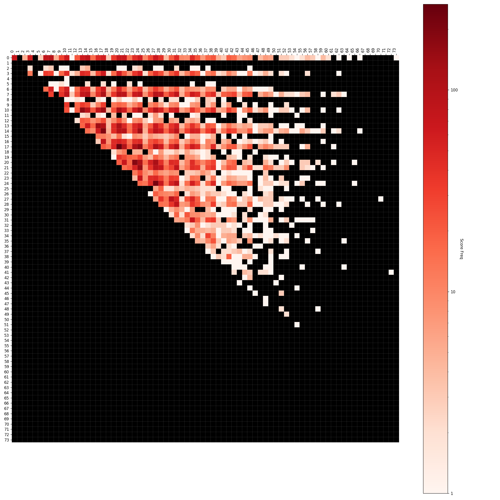
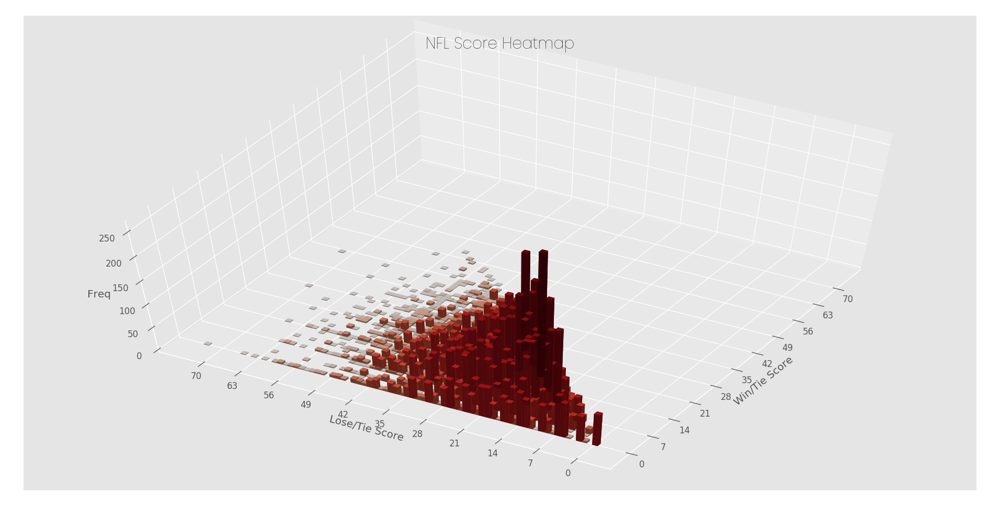

# NFL Score Heatmap

Isometric/Perspective Heatmaps showing the frequency of NFL scores.

## Usage

```bash
Show a heatmap of all NFL scores.

usage: python3.8 run.py [-h]

optional arguments:
  -h, --help  show this help message and exit
```

## Examples

### 2D



### 3D



## Running

-   Create `conda` env from `environment.yml` (see [Install Conda](https://conda.io/projects/conda/en/latest/user-guide/install/index.html))
-   `requirements.txt` is just for GitHub dependency tracking
-   From the root of the folder,

```bash
python3.8 ./run.py
```

## TODO

## Meta

Inspired by SB Nations's video on the subject.

[Every NFL Score Ever | Chart Party](https://www.youtube.com/watch?v=9l5C8cGMueY)
